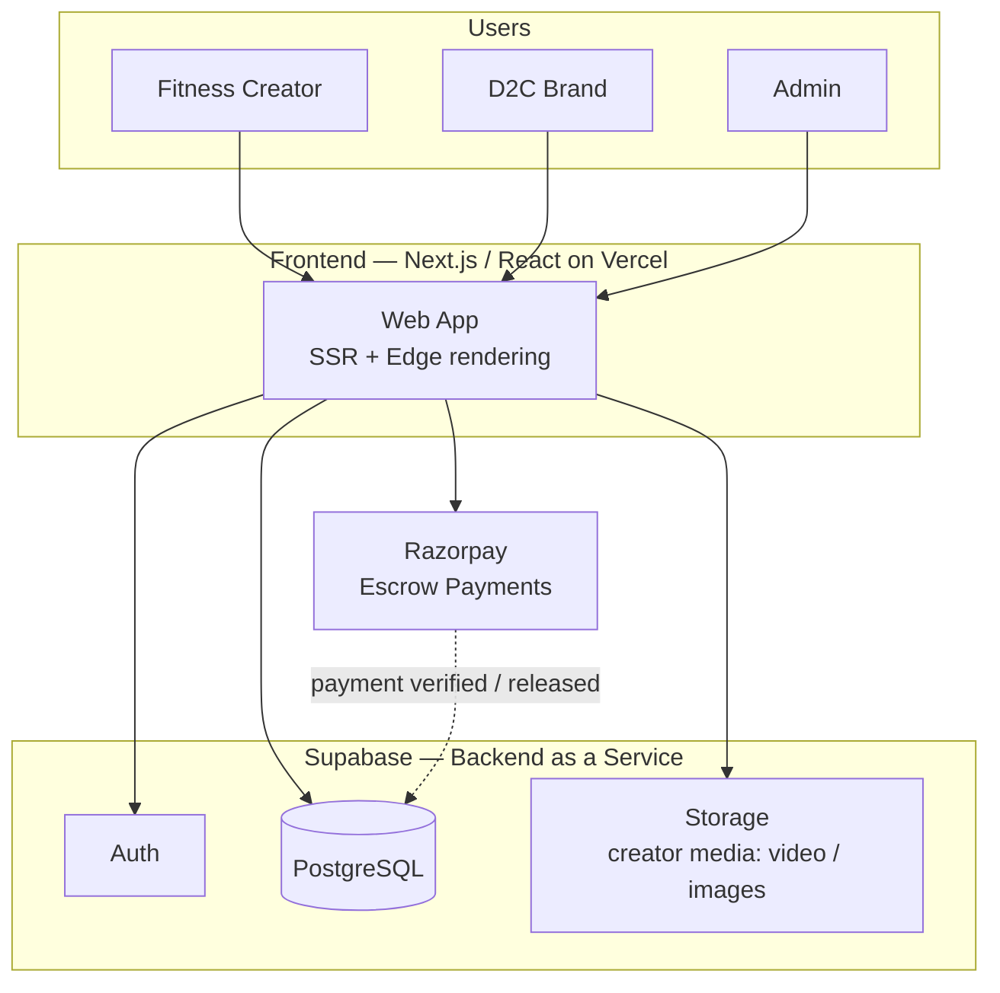

# ReelFit 💪

**India's first fitness-creator content marketplace** — connecting fitness creators with D2C brands for authentic UGC (user-generated content) campaigns.

🔗 **Live:** [reelfit.in](https://www.reelfit.in)  ·  📸 **Instagram:** [@reelfit.india](https://www.instagram.com/reelfit.india)

> 📌 **This is a public showcase repository.** It documents the product, architecture, and engineering decisions behind ReelFit. The application source code is kept **private** because ReelFit is a live commercial product handling real payments. Source access can be shared on request during hiring conversations.

---

## Overview

ReelFit is a two-sided marketplace that connects **fitness creators** (gym, yoga, nutrition, athletics, coaching) with **D2C brands** that want authentic, conversion-focused content instead of inflated follower numbers.

Brands launch campaigns and pay upfront into escrow; creators deliver content; funds are released once the work is approved. Every creator and campaign is manually reviewed. The platform is built India-first, with support for multiple regional languages.

Designed, built, and deployed end-to-end as a solo full-stack project.

---

## ✨ Key Features

- **Two-sided onboarding** — separate signup and profile flows for creators and brands.
- **Escrow payments** — Razorpay integration where brand funds are held until content is delivered and approved, then released (15% platform fee on completion).
- **Manual curation** — every creator and campaign is reviewed before going live to keep quality high and eliminate fake metrics.
- **Campaign management** — end-to-end flow from brief → match → delivery → payout, with dashboards for earnings, analytics, and deal pipeline.
- **Admin panel** — internal tooling for reviewing creators, approving campaigns, and managing the marketplace.
- **Creator discovery** — browse and filter verified creators by fitness niche.
- **Multilingual, India-first** — content campaigns supported across English, Hindi, Tamil, Telugu, Kannada, Malayalam, Marathi, and Bengali.

---

## 🏗️ Architecture

---

## 🔁 Campaign Lifecycle

1. **Discover** — a brand browses verified creators filtered by niche, reach, and content style.
2. **Brief & match** — the brand creates a campaign; creators are matched on audience, style, and budget.
3. **Pay into escrow** — the brand pays upfront via Razorpay; funds are held securely.
4. **Create & deliver** — the creator produces the agreed UGC and submits it.
5. **Approve & release** — once approved, escrow is released to the creator (minus the 15% platform fee).

---

## 🧰 Tech Stack

| Layer | Technology |
| --- | --- |
| Frontend | Next.js, React |
| Hosting / Deployment | Vercel |
| Database | Supabase (PostgreSQL) |
| Authentication | Supabase Auth |
| File storage | Supabase Storage (creator video & image media) |
| Payments | Razorpay (escrow / hold-and-release flow) |
| Languages supported | English, Hindi, Tamil, Telugu, Kannada, Malayalam, Marathi, Bengali |

> _Adjust this table to match your exact stack (e.g. TypeScript, Tailwind CSS, any libraries) before publishing._

---

## 🧠 What This Project Demonstrates

- **End-to-end ownership** — product, design, frontend, backend, database, deployment, and payments shipped solo.
- **Payments engineering** — a real escrow flow with hold-and-release logic and a platform fee, not a mock checkout.
- **Cloud-native, serverless architecture** — Vercel + Supabase with managed auth, Postgres, and object storage.
- **Marketplace data modelling** — two-sided users, campaigns, escrow state, and an admin curation workflow.
- **Shipping a real product** — a deployed, public app with onboarding, an admin panel, and multilingual support.

---

## 📸 Screenshots

> Add images to a `/screenshots` folder in this repo and they will render below.

| Landing | Browse Creators |
| --- | --- |
|  |  |

| Campaign Flow | Admin Dashboard |
| --- | --- |
|  | ![Admin dashboard]/reelfit7.png) |

---

## 📌 Status

Early-stage. The platform is built and live, and ReelFit is currently onboarding its first creators and brands across India. Actively iterating based on early user feedback.

---

## 👤 Author

**Marish Kandan** — Full-Stack Developer, Mumbai, India

- 🔗 LinkedIn: [maarish-kandan](https://www.linkedin.com/in/maarish-kandan-078923150/)
- ✉️ Email: mari.krrish@gmail.com

---

This repository contains documentation and assets only. No application source code or secrets are included.
